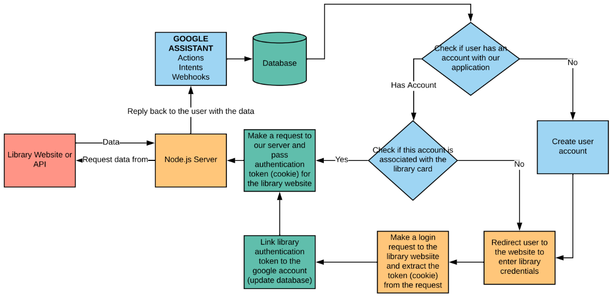
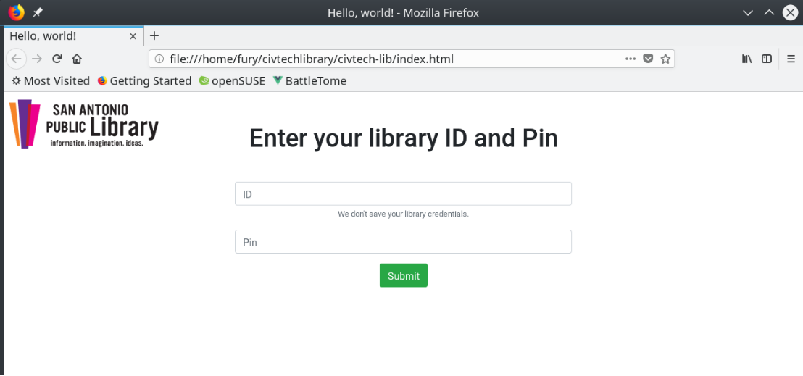

# CivTechSA-Lib

## About Us
The [ACM Students](https://jagsync.tamusa.edu/organization/acm) at [Texas A&M University-San Antonio](http://www.tamusa.edu/) to develop a Google Assistant skill to assist the San Antoniio Public Library with making their current status of books and periodicals aavailable to their patrons. This project was brought to the university through a collaboration between [Geekdom](https://geekdom.com/) and [City of San Antonio (CoSA)](https://www.sanantonio.gov/Innovation/Home) initiative called [CivTechSA](https://www.civtech-sa.com/), a joint effort to promote real-world projects to higher learning. This is our technical solution to solving a very real problem of retrieving library information into your home via voice services, in this case [Google Assistant](https://assistant.google.com/).

## Meet our Team

- Software Architect/Developer: [Artem Skitenko](https://www.linkedin.com/in/artem-skitenko-95ba74b4/)
- Systems Architect: [David Velez](https://linkedin.com/in/dveleztx)
- Data Integration Architect: [Harry Staley](https://www.linkedin.com/in/harrystaley/)
- Cloud Systems Architect: [Clinton Minton](https://www.linkedin.com/in/clinton-minton-76ba29195/)
- Software Developer: [Joshua Sanchez](https://www.linkedin.com/in/jsanchez883/)
- Faculty Sponsor: [Dr. Izzat Alsmadi](https://www.linkedin.com/in/izzat-alsmadi-1510bb5/)

## How it works

### The Challenge

1. *How do we get data from the San Antonio Library's site with the user's library information securely?*
2. *When scraping the San Antonio Public Library site, information is returned in Markup (HTML)*
3. *Google Intents read data in JSON format, thus we must convert data to be readable*

### The Solution

First, we need setup a Node.js Server that performs web crawling and serializes it to JSON format to pass to Google Intents as a response to our queries. Then, using real data that is scraped from the San Antonio Public Library site, we return user specific information such as books checked out, what items are on hold, and more!

### The Process

Our custom library page will have you login, which will check to see if you have a Google account. Using your Google account, we link it to your library account via a *session* key. Once complete, we use the Google Assistant to retrieve your user library information.

**Process Diagram**

**Login Page Concept**

